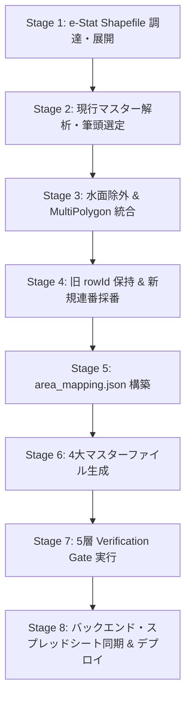

# Skill: Census Small Area Master Protocol（正式国勢調査小地域マスター確立プロトコル v1）

本スキルは、POSTING MAP各地区アプリにおいて、従来の概略町丁区分（町丁名・親大字単位）を、総務省統計局 e-Stat 令和2年国勢調査小地域境界データ（KEY_CODE単位）に基づく**「正式国勢調査小地域マスター」**へクリーンかつ安全に細分化・移行するための標準実行プロトコルである。

MIE-03（三重県第3区: 442 ➔ 587エリア）および OKAYAMA-02（岡山県第2区: 508 ➔ 686エリア）において実証・確立された方式を体系化している。

---

## 1. 最上位絶対原則（Absolute Rules）

1. **公式選挙区範囲の固定**:
   - 公職選挙法・都道府県選挙管理委員会の公式告示による区域境界を厳格に順守する。
   - 区域外の小地域を含めたり、区域内の小地域を除外してはならない。
2. **e-Stat KEY_CODE単位の正式区分採用**:
   - 総務省統計局が定める `KEY_CODE`（11桁コード等）を唯一の公式小地域単位のSSOTとする。
3. **同一KEY_CODE飛び地・小島等の MultiPolygon 統合**:
   - 同一の `KEY_CODE` を持つ複数のポリゴン（飛び地、島嶼、集落等）は、別エリアとして重複登録せず、幾何結合（`unary_union`）を行って 1つの MultiPolygon エリアに統合する。
4. **水面調査区の完全除外**:
   - 国勢調査の `HCODE != 8101` または町丁名に「水面」「水域」を含む非陸上エリアは、ポスティング対象外として確実に除外する。
5. **既存 rowId (1〜N) の 100% 保持（参照整合性保護）**:
   - 旧マスターで発行されていた `rowId: 1..N` は、旧システム・既存記録との参照整合性を維持するため、**1件の欠番・重複・改番もなく100%保持**する。
   - 親大字が複数の小地域に分割される場合、人口最多の筆頭小地域に旧 `rowId` を継承させる。
6. **新規分割小地域 (N+1〜M) の連続連番採番**:
   - 分割によって新設される小地域には、`N+1` からの連続連番を衝突ゼロで付番する。
7. **実測人口・世帯数の完全突合（差分ゼロ証明）**:
   - マスターに登録する人口・世帯数は、e-Stat 原本の属性値（`JINKO`, `SETAI`）と 100% 突合し、地区合計値が差分 0 であることを客観的に証明する。
8. **地区固有ハードコードの絶対禁止**:
   - アプリケーション本体（`active/`）に地区名・地区ID・座標・自治体名などをハードコードしてはならない。すべて `data/` 配下のマスターCSV・GeoJSONおよび Spreadsheet 名から動的に導出させる。

---

## 2. 実績移行の 2大モード（Transition Modes）

地区の運用フェーズに応じて、以下のいずれかのモードを選択して適用する。

### モードA: 本番実績継承モード（MIE-03 方式）
- **適用条件**: 既に本番運用中で、過去の配布完了実績が多数存在する場合。
- **仕様**:
  - `data/area_mapping.json` において、分割子小地域に `status_inherited: "COMPLETED"` を付与する。
  - フロントエンド（`manager.js`）は `areaMapping` を読み込み、親エリアが完了であれば、継承指定された子小地域も自動的に完了（COMPLETED）として表示する。
  - 過去実績の回帰検証を厳格に実施する。

### モードB: クリーン初期化モード（OKAYAMA-02 方式）
- **適用条件**: 既存実績が開発・テスト時のダミーデータであり、正式稼働に向けて初期化する場合。
- **仕様**:
  - `data/area_mapping.json` において、全小地域を `status_inherited: "UNASSIGNED"` として登録する。
  - 旧 `rowId` の参照関係は保持しつつ、ステータスは全小地域が未配布（0%）からクリーンに開始される。

---

## 3. 標準実行パイプライン（7-Stage Protocol）



### Stage 1: e-Stat 国勢調査小地域 Shapefile の調達と展開
- 政府統計の総合窓口（e-Stat）より、対象市区町村の令和2年国勢調査「小地域（町丁・字等別境界データ）」Shapefile（世界測地系緯度経度・JGD2000 / JGD2011）を調達する。
- 配置先: `data/raw_estat_r2/{市区町村コード}/r2ka{市区町村コード}.shp`

### Stage 2: 現行マスターの構造解析と筆頭継承候補の特定
- `git show HEAD:data/address_master.csv` から旧マスター（1..N件）を読み込む。
- 各市区町村ごとに、e-Stat 小地域との対応関係（1:1 対応町丁、1:N 分割親大字）を全数分類する。

### Stage 3: 水面除外と同一KEY_CODEマルチポリゴン統合
- Python（`shapefile`, `shapely`）を用いて Shapefile を解析。
- `HCODE != 8101` および「水面」「水域」調査区をスキップ。
- 同一 `KEY_CODE` を持つレコードは幾何データを集約し、`unary_union` で 1つの MultiPolygon に融合。
- 不正ジオメトリ（Self-intersection等）は `geom.buffer(0)` で修復。
- 代表座標は融合後ジオメトリの図心（`u_geom.centroid`）から算出（緯度経度小数第6位丸め）。

### Stage 4: 既存 rowId の保護と新規 rowId の連続採番
- **旧 rowId (1..N)**:
  - 1:1 対応町丁: 旧 `rowId` をそのまま割り当て。
  - 1:N 分割大字: 人口最多（または大字名完全一致）の筆頭小地域に旧 `rowId` を割り当て。
  - アサーション: `used_row_ids == set(range(1, N + 1))` で 100% 保持を確認。
- **新規 rowId (N+1..M)**:
  - 未割り当ての分割子小地域（M - N 件）を、自治体コード ➔ 親大字ID ➔ KEY_CODE の安定した順序でソート。
  - `N + 1` から `M` まで昇順に連続付番。
  - アサーション: `used_row_ids == set(range(1, M + 1))` で衝突・重複ゼロを確認。

### Stage 5: 全件対応表（`data/area_mapping.json`）の構築
- 旧 1..N の親大字ごとに、紐づく子小地域（新 rowId, 自治体名, 町名, e_stat_code, 人口, 世帯数, 座標, 継承設定）を配列として構造化。
- モードに応じた `status_inherited`（"COMPLETED" または "UNASSIGNED"）を設定。
- 出力先: `data/area_mapping.json` および `docs/area_mapping_{district}.json`。

### Stage 6: 4大マスターファイルの一括生成
1. `data/address_master.csv`:
   - ヘッダ: `rowId,city_name,town_name,latitude,longitude,households,population,e_stat_code`
   - 改行コード: LF (`lineterminator="\n"`)
2. `data/boundaries.geojson`:
   - CRS: `urn:ogc:def:crs:OGC:1.3:CRS84`
   - Properties: `rowId,city_name,town_name,households,population,e_stat_code`
3. `data/municipality_master.csv`:
   - 各自治体ごとの確定エリア数（例: 中区130, 東区138, 南区111, 玉野89, 瀬戸内218）
4. `data/area_mapping.json`:
   - 全件対応表

### Stage 7: 5層 Verification Gate
1. **V1 Static Verification**:
   - rowId 連続性 (1..M)、旧 rowId 参照保持。
   - 原本との人口・世帯数突合（差分 0 の証明）。
   - `git diff --check` で空白・改行コードの完全チェック。
2. **V2 Runtime Verification (ブラウザ実機検証)**:
   - Chrome DevTools MCP を用い、マネージャー画面（`active/manager/index.html`）を開く。
   - `DashboardState.masterPins.length === M`、`masterLoadStatus === 'LOADED'`。
   - ピン選択時に右下エリア統計（実人口・実世帯数）が即座に連動表示されること。
   - 自治体セレクターの全自治体項目・件数・フィルタリング連動の確認。
   - Console Error / Network Error 0 件の確認。
3. **V3 Regression Verification**:
   - 既存機能・現場アプリ認証境界（LINE OAuth リダイレクト）の正常性確認。
4. **Auditor Subagent 独立検品**:
   - 5観点（地区非依存、スコープ厳守、証跡、ゼロ手作業、公式データ確定）による客観査読 PASS。
5. **Audit Gate**:
   - `npm run audit:gate` (Scope Guard & Governance Gate) の通過。

### Stage 8: バックエンド・スプレッドシート月次業務データ同期（Backend & Spreadsheet Deployment Gate）
マスターの更新完了後、フロントエンドだけでなく「スプレッドシート業務データ」「GASバックエンド」「本番API」までを完全に一本につなぎ直す。

1. **Spreadsheet業務データ・原本の同期 (`DistrictProvisioner`)**:
   - `scripts/provision-district.mjs` を実行し、GAS側で `DistrictProvisioner.getInstance().provisionNewDistrict(addresses, options)` をトリガーする。
   - **「配布実績の原本」**: 新マスターの全件数（M件）に展開。
   - **当月業務シート「配布実績YYYY-MM」**:
     - **クリーン初期化モード時**: `--reset-existing-records`（`options.resetExistingRecords === true`）を明示指定して全M件を初期化（完了0件、0%）。
     - **重要**: `resetExistingRecords: true` はデフォルト動作にしてはならない。明示指定時のみクリーン初期化し、指定がない場合は既存実績を保護すること（本番実績継承地区での不用意なデータ消失を防止）。
2. **GASバックエンドの同期 & 本番デプロイ**:
   - `npx clasp push` で最新HEADコードをGASプロジェクトへ反映。
   - `npx clasp deploy -i <DeploymentId> -d "<ReleaseNote>"` で本番Versionを更新。
3. **本番 API 実測値・実機検証**:
   - `getSystemSummary` を呼び出し、以下を客観的Evidenceとして確認する：
     - `districtName`: 対象地区コード（スプレッドシート名SSOT）
     - `total`: M件（新小地域マスター総数）
     - `done`: 0（クリーン初期化時）または継承完了数
     - `percent`: 0%（クリーン初期化時）または継承完了率
     - `online`: true
   - **Hアプリ / Manager実機**: ヘッダーおよび統計バッジで M件 / 0 / 0% を確認。

---

## 4. Python 生成スクリプト設計パターン（Best Practices）

マスター生成スクリプトは以下のパターンに従って記述する：

```python
import os
import csv
import json
import subprocess
import shapefile
from collections import defaultdict
from shapely.geometry import shape, mapping
from shapely.ops import unary_union

# 1. 旧マスターを Git HEAD から安全・冪等に取得
head_csv = subprocess.check_output(["git", "show", "HEAD:data/address_master.csv"]).decode("utf-8")
orig_rows = list(csv.DictReader(head_csv.splitlines()))
N = len(orig_rows)

# 2. Shapefile 読込と同一 KEY_CODE の幾何統合
# ... (水面除外: HCODE != 8101 or "水面" in name or "水域" in name)
# ... (幾何結合: unary_union(geoms), 幾何修復: geom.buffer(0))
# ... (代表点: u_geom.centroid)

# 3. 旧 rowId 1..N 保持と新 rowId N+1..M 昇順採番
# ... (アサーション: used_row_ids == set(range(1, M + 1)))

# 4. LF 改行による CSV 出力 (trailing whitespace 防御)
with open("data/address_master.csv", "w", encoding="utf-8", newline="\n") as f:
    writer = csv.writer(f, lineterminator="\n")
    writer.writerow(["rowId", "city_name", "town_name", "latitude", "longitude", "households", "population", "e_stat_code"])
    writer.writerows(rows)
```

---

## 5. Hard Stop 条件

以下の事象が検知された場合、作業を直ちに HARD STOP し、推測による変更を行わず MASTER へ報告すること：
1. **人口・世帯数合計値の原本不一致**:
   - e-Stat 原本集計値との間に 1人・1世帯でも説明不能な差分がある場合。
2. **既存 rowId の欠番・改番**:
   - 旧 1..N のいずれかの ID が失われたり、別の大字に割り当てられた場合。
3. **水面調査区の混入**:
   - ポスティング不可能な水面・海上・河川エリアが含まれている場合。
4. **地区固有情報のコード侵入**:
   - `active/` 配下のスクリプトに特定地区固有の名称・座標・コード分岐が書き込まれそうになった場合。
