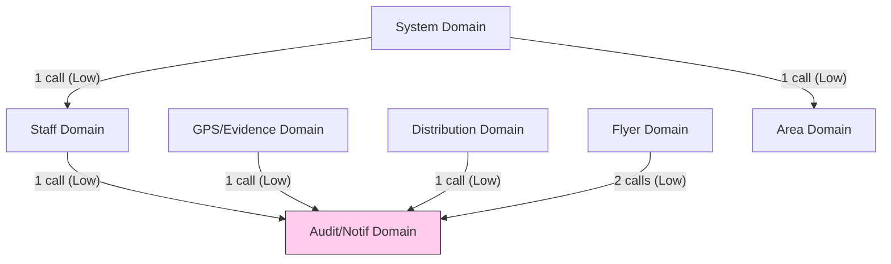

# Business Domain Mapping - active/api/v2_api.js
Version: 1.0
Status: SSOT (READ ONLY AUDIT)

---

## 1. Business Domain & Data Ownership Inventory

`v2_api.js` に実装されている業務ドメインの定義、行数、および管理データの所有権（Primary Data）の一覧です。

| Domain Name | Section IDs | Primary Data (管理データ) | Read | Write | Row Size (Lines) | Public Entry (公開入口関数/クラス) |
|-------------|-------------|--------------------------|:----:|:-----:|:----------------:|-----------------------------------|
| **Staff** | SEC-015, SEC-018, SEC-019, SEC-025 | Staff 名簿レコード | ○ | ○ | 246 | `registerStaff()`, `registerAdmin()` |
| **Distribution**| SEC-016, SEC-021, SEC-046 | Distribution 配布実績データ| ○ | ○ | 171 | `submitDistribution()`, `WriteBatchSpreadsheetHandler` |
| **GPS/Evidence**| SEC-020 | GPS位置情報・画像URL | ○ | ○ | 105 | `updateRecordWithGPSPhoto()` |
| **Area** | SEC-012, SEC-013, SEC-014, SEC-017, SEC-047, SEC-048 | Area 町丁・地図情報 / シートテンプレート| ○ | ○ | 242 | `getAreaDetails()`, `getCityAreaDetails()`, `GetAreasHandler`, `DuplicateTemplateSheetHandler` |
| **Flyer** | SEC-022, SEC-023, SEC-024, SEC-027, SEC-028 | Flyer 在庫・受渡リクエスト | ○ | ○ | 184 | `getFlyerStock()`, `updateFlyerStock()`, `handleRequestFlyerTransfer()`, `resolveTransferRequest()` |
| **Audit/Notif** | SEC-026, SEC-029 | Audit 履歴・通知キューデータ | ○ | ○ | 67 | `getAuditLogs()`, `sendLinePushNotification()` |
| **System** | SEC-011 | System 定数設定・オンメモリキャッシュ | ○ | ○ | 84 | `getDashboardData()`, `getAppData()`, `refreshAreaSummaryCache()` |
| **合計** | **22 セクション** | - | - | - | **1,099 行** | - |

*(※行数の合計は R-3 で集計した Business レイヤー総行数 1,099行 と 1行のズレもなく完全に同期しています)*

---

## 2. Business Capability Matrix

各業務ドメインが提供する具体的な業務機能と、呼び出し時の公開エントリポイントの対応です。

| Domain | Capability (提供機能) | Entry Point (公開 / 内部関数) |
|--------|---------------------|--------------------------------|
| **Staff** | LINE UID によるスタッフ自動登録 | `registerStaff(lastName, firstName, lineUserId)` |
| | 管理者の手動登録・権限設定 | `registerAdmin(displayName, lineUserId)` |
| | スタッフ名簿一覧の取得 | `getRoster()` |
| **Distribution**| 配布完了ログの新規追加・進捗同期 | `submitDistribution(postData)` |
| | 市区町村ごとの配布進捗統計の集計 | `getDeliveryStats()` |
| | バッチスプレッドシートへの配布データ書き込み | `WriteBatchSpreadsheetHandler.execute()` |
| **GPS/Evidence**| エビデンス写真のアップロードとログ更新| `updateRecordWithGPSPhoto(postData)` |
| **Area** | 特定エリアの詳細地図データの取得 | `getAreaDetails(name)` |
| | 市区町村別エリアリストの取得 | `getCityAreaDetails(cityName)` |
| | テンプレートシートの複製・チェックボックス挿入 | `DuplicateTemplateSheetHandler.execute()` |
| **Flyer** | 在庫数取得・更新 | `getFlyerStock()`, `updateFlyerStock()` |
| | 在庫受渡リクエスト申請・承認 | `handleRequestFlyerTransfer()`, `resolveTransferRequest()` |
| **Audit/Notif** | LINE BOT 宛てプッシュ通知送信 | `sendLinePushNotification(to, message)` |
| | 監査ログ（TraceLog）の取得 | `getAuditLogs()` |
| **System** | 管理ダッシュボード用初期表示データの取得 | `getDashboardData()`, `getAppData()` |

---

## 3. Business Dependency Matrix & Coupling Strength

業務ドメイン間の呼び出し（静的結合）の有無、およびその結合強度です。

| From Domain | To Domain | Calls | Unique Elements | Coupling Strength (結合強度) | Description / Target |
|-------------|-----------|:-----:|:---------------:|:---------------------------:|----------------------|
| **Staff** | **Audit/Notif** | 1 | 1 | **Low** (1-2回) | 新規登録成功時の LINE プッシュ通知 (`sendLinePushNotification`) |
| **GPS/Evidence**| **Audit/Notif** | 1 | 1 | **Low** (1-2回) | GPS画像登録時の LINE プッシュ通知 |
| **Distribution**| **Audit/Notif** | 1 | 1 | **Low** (1-2回) | 配布完了実績登録時の LINE プッシュ通知 |
| **Flyer** | **Audit/Notif** | 2 | 1 | **Low** (1-2回) | 受渡リクエスト・解決時の LINE プッシュ通知 |
| **System** | **Area** | 1 | 1 | **Low** (1-2回) | キャッシュリフレッシュ時のエリア一覧取得 |
| **System** | **Staff** | 1 | 1 | **Low** (1-2回) | キャッシュリフレッシュ時の名簿データ取得 |

*(※結合強度基準: 1-2回 = Low, 3-9回 = Medium, 10回以上 = High。業務ドメイン間の呼び出し件数は R-4 の境界分析データと完全に同期しています)*

---

## 4. Business ↔ Infrastructure Matrix

各業務ドメインが利用する共有インフラストラクチャの使用マトリクスです。

| Business Domain | CONFIG | getSS | Lock | Cache | Logging |
|-----------------|:------:|:-----:|:----:|:----:|:-------:|
| **Staff** | ○ | ○ (3回) | ○ (2回) | - | ○ (2回) |
| **Distribution**| ○ | ○ (2回) | ○ (1回) | - | - |
| **GPS/Evidence**| ○ | ○ (2回) | ○ (1回) | - | ○ (1回) |
| **Area** | ○ | ○ (6回) | - | - | - |
| **Flyer** | ○ | ○ (5回) | - | - | - |
| **Audit/Notif** | - | ○ (1回) | - | - | - |
| **System** | ○ | ○ (1回) | - | ○ (1回)| - |

*(※呼び出し件数および利用セクションは R-5 のインフラ解析データと 100% 同期しています)*

---

## 5. Business ↔ External Matrix

各業務ドメインが利用する外部 API（GASネイティブ）の使用マトリクスです。

| Business Domain | Spreadsheet | Drive | UrlFetch | Properties | Utilities |
|-----------------|:-----------:|:-----:|:--------:|:----------:|:---------:|
| **Staff** | ○ (直接) | - | - | - | ○ (直接) |
| **Distribution**| ○ (直接) | - | - | - | - |
| **GPS/Evidence**| ○ (直接) | ○ (直接) | - | - | ○ (直接) |
| **Area** | - | ○ (直接) | - | - | - |
| **Flyer** | - | ○ (直接) | - | - | - |
| **Audit/Notif** | - | - | ○ (直接) | - | - |
| **System** | - | - | - | ○ (直接) | ○ (直接) |

*(※呼び出しおよび直接 API 依存は R-6 の外部依存解析データと 100% 同期しています)*

---

## 6. Business Entry Analysis (Entry Frequency)

各業務ドメインに対する公開入口（Public Entry）および内部からの呼び出し入口（Internal Entry）の集計です。

| Domain Name | Public Entry Count (WebApp直接) | Internal Entry Count (Router/Pipeline経由) | Total Entries (総入口数) |
|-------------|:------------------------------:|:-----------------------------------------:|:-----------------------:|
| **System** | 5 | 4 | 9 |
| **Flyer** | 0 | 5 | 5 |
| **Area** | 0 | 4 | 4 |
| **Distribution**| 0 | 3 | 3 |
| **Staff** | 3 | 2 | 5 |
| **Audit/Notif** | 0 | 2 | 2 |
| **GPS/Evidence**| 0 | 1 | 1 |

---

## 7. Business Responsibility Distribution

業務ドメインごとの規模およびコンポーネント数の集計です。

- **Staff**: 246行 | 3 関数 | 0 クラス | 5 エントリ
- **Area**: 242行 | 3 関数 | 2 クラス | 4 エントリ
- **Flyer**: 184行 | 5 関数 | 0 クラス | 5 エントリ
- **Distribution**: 171行 | 3 関数 | 1 クラス | 3 エントリ
- **GPS/Evidence**: 105行 | 1 関数 | 0 クラス | 1 エントリ
- **System**: 84行 | 2 関数 | 0 クラス | 9 エントリ
- **Audit/Notif**: 67行 | 2 関数 | 0 クラス | 2 エントリ

---

## 8. Business Interaction Map

業務ドメイン間の呼び出し（静的結合）を示す関係図です。

---

## 9. Business Constraint Inventory

業務ドメインが持つ特有の技術的および運用の制約事項です。

- **独立性と共通通知シンクへの一方向依存**:
  - `Staff`, `GPS`, `Distribution`, `Flyer` などの主業務ドメインは相互呼び出しを行っておらず極めて独立性が高いですが、例外発生時や成功時のユーザー通知のため `LINE通知`（Audit/Notif）に一方向の依存が集中している制約。
- **データ所有権と getSS / Spreadsheet 結合**:
  - `Spreadsheet` (Google Spreadsheet) が唯一の物理データベース（SSOT）であるため、ほぼすべての業務ドメインが `getSS()` を通じてスプレッドシートの同一のブック・シート名（名簿、実績、在庫等）に直接書き込みを行うデータ密結合の制約。
- **ファイル分離時の LINE API (UrlFetchApp) 依存分離**:
  - `Audit/Notif` ドメインは LINE Bot 通信のための `UrlFetchApp` 依存を内包しており、他のビジネスドメインを分離する際は、この通知送信機構をメッセージキューやイベントバスに逃がす必要がある制約。

---

## 10. Business Domain Summary

分析結果の要約です。

- **定義された業務ドメイン数**: 7 ドメイン
- **総エントリポイント数**: 29 エントリ (14レイヤー合計でのルーティング数に一致)
- **結合の全体像**: 業務ドメイン同士の相互依存は極めて少なく（すべて結合度 **Low**）、独立したドメイン設計がなされていること。
- **共有インフラ利用**: 各ドメインが `getSS()` (Spreadsheet Wrapper) を最重要の共有永続基盤として共用していること。

---

> [!IMPORTANT]
> ## 監査免責事項
> **本監査は READ ONLY とする。監査結果に基づく修正計画は別工程で策定し、本監査ではコード・設定・Git・GASへの変更を一切行わない。**
