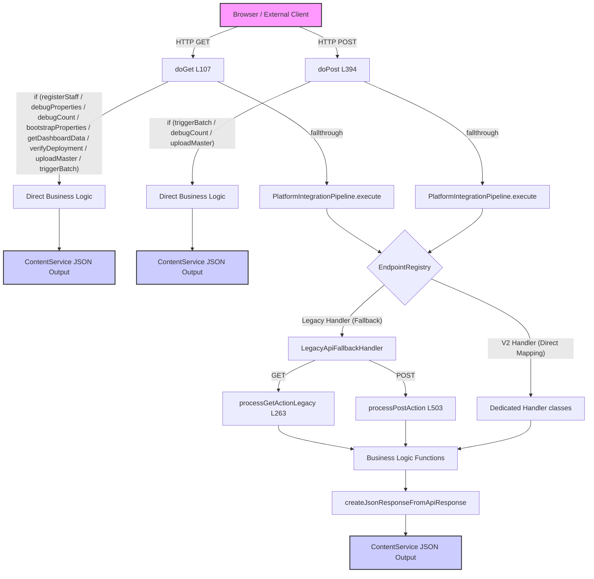

# Entry Point & Routing Mapping - SEC-006 to SEC-009
Version: 1.0
Status: SSOT (READ ONLY AUDIT)

---

## 1. Entry Point Inventory (SEC-006, SEC-008)

### doGet (SEC-006)
- **開始-終了行**: L107-L262 (156行)
- **主責務**: HTTP GET リクエストの受け口。クエリおよび json パラメータのパースを行い、特定の管理アクションについては if 分岐で即時実行して ContentService で返し、それ以外は Pipeline に流す。
- **入力**: GAS の GET イベントオブジェクト `e` (クエリパラメータ)
- **出力**: 正常/異常応答の `TextOutput` (MIME: JSON) または PlatformIntegrationPipeline からの返却オブジェクト。
- **呼び出し先**:
  - `registerStaff()` (Business)
  - `getSS()` (Utility)
  - `PropertiesService`
  - `getDashboardData()` (Business, v2_core.gs内)
  - `verifyDistrictDeployment()` (Business, v2_deployment_foundation.gs内)
  - `Utilities.parseCsv()` (GAS API)
  - `forceStartBatch()`, `generateAreaSheetsBatch()` (Business, v2_batch.gs内)
  - `PlatformIntegrationPipeline.execute()` (Pipeline)

### doPost (SEC-008)
- **開始-終了行**: L394-L502 (109行)
- **主責務**: HTTP POST リクエストの受け口。リクエストボディの JSON パースを行い、特定の管理アクション（triggerBatch, debugCount, uploadMaster）については if 分岐で即時実行して ContentService で返し、それ以外は Pipeline に流す。
- **入力**: GAS の POST イベントオブジェクト `e` (postData 含む)
- **出力**: 正常/異常応答の `TextOutput` (MIME: JSON) または PlatformIntegrationPipeline からの返却オブジェクト。
- **呼び出し先**:
  - `forceStartBatch()`, `generateAreaSheetsBatch()` (Business)
  - `getSS()` (Utility)
  - `Utilities.parseCsv()` (GAS API)
  - `PlatformIntegrationPipeline.execute()` (Pipeline)

---

## 2. Routing Inventory (SEC-007, SEC-009)

### processGetActionLegacy (SEC-007)
- **開始-終了行**: L263-L393 (131行)
- **主責務**: 旧形式のリクエストパラメータに基づく GET アクションのディスパッチ。
- **switch数 / case数**: 1 switch / 23 case (フォールスルー含む)
- **default処理**: `response = { success: true, message: 'POSTING MAP API is online.' };` (API稼働確認用メッセージ返却)
- **呼び出し先**:
  - `getDashboardData()`, `getRankingData()`, `getRoster()`, `getAreaDetails()`, `getCityAreaDetails()`, `verifyDistrictDeployment()`, `registerStaff()`, `getDeliveryStats()`, `getFlyerStock()`, `getTransferRequests()`, `runMigrationToEventLog()`, `generateReconciliationReport()`, `executeSystemFreeze()`, `getConfig()`, `getAuditLogs()`, `refreshAreaSummaryCache()`, `generateStrategy()`, `generateHeatmap()`, `predictOutcome()`
- **戻り値**: アクション実行結果オブジェクト（`response`）

### processPostAction (SEC-009)
- **開始-終了行**: L503-L635 (133行)
- **主責務**: 旧形式のリクエストパラメータに基づく POST アクションのディスパッチ。FormData（e.parameter.json）からのマージ処理を含む。
- **switch数 / case数**: 1 switch / 25 case (フォールスルー含む)
- **default処理**: `return { success: false, message: 'Invalid POST action' };`
- **呼び出し先**:
  - `forceStartBatch()`, `generateAreaSheetsBatch()`, `getAppData()`, `getConfig()`, `generateStrategy()`, `generateHeatmap()`, `predictOutcome()`, `getRankingData()`, `getRoster()`, `getAreaDetails()`, `getCityAreaDetails()`, `submitDistribution()`, `verifyDistrictDeployment()`, `updateRecordWithGPSPhoto()`, `registerStaff()`, `registerAdmin()`, `handleRequestFlyerTransfer()`, `resolveTransferRequest()`, `setupRosterSheet()`, `setupGoogleDriveFolders()`, `createSystemCacheSheet()`, `refreshAreaSummaryCache()`, `aggregateTotalVolumes()`, `deleteAllAreaSheets()`, `updateFlyerStock()`
- **戻り値**: アクション実行結果オブジェクト

---

## 3. Entry Flow Diagram

---

## 4. Request Flow Matrix & Flow IDs

Browser リクエストから処理終端までの全実行経路にIDを付与したマトリクスです。

| Flow ID | HTTP | Entry Point | Router / Registry | Pipeline Target | Business / Handler Target | Flow Termination (終了地点) |
|---------|------|-------------|-------------------|-----------------|---------------------------|----------------------------|
| **FLOW-001** | GET | doGet | if (registerStaff) | - | `registerStaff()` | `ContentService` JSON (正常終了) |
| **FLOW-002** | GET | doGet | if (debugProperties) | - | `getSS()`, `getName()` | `ContentService` JSON (正常終了) |
| **FLOW-003** | GET | doGet | if (debugCount) | - | `getSS()`, `getSheetByName()` | `ContentService` JSON (正常終了) |
| **FLOW-004** | GET | doGet | if (bootstrapProperties) | - | `PropertiesService` 直接操作 | `ContentService` JSON (正常終了) |
| **FLOW-005** | GET | doGet | if (getDashboardData) | - | `getDashboardData()` | `ContentService` JSON (正常終了) |
| **FLOW-006** | GET | doGet | if (verifyDeployment) | - | `verifyDistrictDeployment()` | `ContentService` JSON (正常終了) |
| **FLOW-007** | GET | doGet | if (uploadMaster) | - | `Utilities.parseCsv()` | `ContentService` JSON (正常/異常終了) |
| **FLOW-008** | GET | doGet | if (triggerBatch) | - | `forceStartBatch()` | `ContentService` JSON (正常終了) |
| **FLOW-009** | GET | doGet | fallthrough | PlatformIntegrationPipeline | Legacy switch-case logic | `ContentService` JSON (正常/例外終了) |
| **FLOW-010** | POST | doPost | if (triggerBatch) | - | `forceStartBatch()` | `ContentService` JSON (正常終了) |
| **FLOW-011** | POST | doPost | if (debugCount) | - | `getSS()`, `getSheetByName()` | `ContentService` JSON (正常終了) |
| **FLOW-012** | POST | doPost | if (uploadMaster) | - | `Utilities.parseCsv()` | `ContentService` JSON (正常/異常終了) |
| **FLOW-013** | POST | doPost | fallthrough | PlatformIntegrationPipeline | Legacy switch-case logic | `ContentService` JSON (正常/例外終了) |
| **FLOW-014** | GET | doGet | `/version` (v2) | PlatformIntegrationPipeline | `VersionHandler` (Stub) | `ApiException` (Stub 501 異常終了) |
| **FLOW-015** | GET | doGet | `/health` (v2) | PlatformIntegrationPipeline | `HealthHandler` (Stub) | `ApiException` (Stub 501 異常終了) |
| **FLOW-016** | POST | doPost | `/writeBatchSpreadsheet` | PlatformIntegrationPipeline | `WriteBatchSpreadsheetHandler` | `ContentService` JSON (正常/例外終了) |
| **FLOW-017** | GET | doGet | `/getAreas` | PlatformIntegrationPipeline | `GetAreasHandler` | `ContentService` JSON (正常/例外終了) |
| **FLOW-018** | POST | doPost | `/duplicateTemplateSheet` | PlatformIntegrationPipeline | `DuplicateTemplateSheetHandler`| `ContentService` JSON (正常/例外終了) |
| **FLOW-019** | POST | doPost | `/createTestSpreadsheet` | PlatformIntegrationPipeline | `CreateTestSpreadsheetHandler` | `ContentService` JSON (正常/例外終了) |
| **FLOW-020** | POST | doPost | `/cleanupTestSpreadsheet` | PlatformIntegrationPipeline | `CleanupTestSpreadsheetHandler`| `ContentService` JSON (正常/例外終了) |

---

## 5. Action Inventory (Routing & Layer Mapping)

各 API アクション（`action`）がどの層を通過し、最終的にどのビジネスロジックに到達するかのクロスリファレンスです。

| Action Name | GET | POST | doGet if | doPost if | Legacy switch | Pipeline Registry | Target Business Function |
|-------------|:---:|:----:|:--------:|:---------:|:-------------:|:-----------------:|--------------------------|
| **registerStaff** | ○ | ○ | ○ | - | ○ (GET/POST) | - (Legacy Bridge) | `registerStaff()` |
| **debugProperties** | ○ | - | ○ | - | - | - | `getSS()`, `getName()` |
| **debugCount** | ○ | ○ | ○ | ○ | - | - | 名簿件数取得処理直接実行 |
| **bootstrapProperties** | ○ | - | ○ | - | - | - | PropertiesService 直接実行 |
| **getDashboardData / getAppData / getSummary** | ○ | ○ | ○ | - | ○ (GET/POST) | - (Legacy Bridge) | `getDashboardData()`, `getAppData()` |
| **verifyDeployment** | ○ | ○ | ○ | - | ○ (GET/POST) | - (Legacy Bridge) | `verifyDistrictDeployment()` |
| **uploadMaster** | ○ | ○ | ○ | ○ | - | - | 住所マスターシートへの流し込み直接処理 |
| **triggerBatch / forceStartBatch** | ○ | ○ | ○ | ○ | ○ (POSTのみ) | - (Legacy Bridge) | `forceStartBatch()`, `generateAreaSheetsBatch()` |
| **getRanking** | ○ | ○ | - | - | ○ (GET/POST) | - (Legacy Bridge) | `getRankingData()` |
| **getRoster** | ○ | ○ | - | - | ○ (GET/POST) | - (Legacy Bridge) | `getRoster()` |
| **getAreaDetails** | ○ | ○ | - | - | ○ (GET/POST) | - (Legacy Bridge) | `getAreaDetails()` |
| **getCityAreaDetails** | ○ | ○ | - | - | ○ (GET/POST) | - (Legacy Bridge) | `getCityAreaDetails()` |
| **submitDistribution** | ○ | ○ | - | - | ○ (GET/POST) | - (Legacy Bridge) | `submitDistribution()` |
| **testDriveAccess / testDriveWrite** | ○ | - | - | - | ○ (GETのみ) | - | DriveApp 疎通確認テスト処理 |
| **getDeliveryStats** | ○ | - | - | - | ○ (GETのみ) | - | `getDeliveryStats()` |
| **getFlyerStock** | ○ | - | - | - | ○ (GETのみ) | ○ (GET v2 `/holding`) | `getFlyerStock()` |
| **updateFlyerStock** | - | ○ | - | - | ○ (POSTのみ) | ○ (POST v2 `/holding`) | `updateFlyerStock()` |
| **getTransferRequests** | ○ | - | - | - | ○ (GETのみ) | - | `getTransferRequests()` |
| **runMigration** | ○ | - | - | - | ○ (GETのみ) | - | `runMigrationToEventLog()` |
| **runReconciliation** | ○ | - | - | - | ○ (GETのみ) | - | `generateReconciliationReport()` |
| **runFreeze** | ○ | - | - | - | ○ (GETのみ) | - | `executeSystemFreeze()` |
| **getConfig** | ○ | ○ | - | - | ○ (GET/POST) | - | `getConfig()` |
| **getAuditLogs** | ○ | - | - | - | ○ (GETのみ) | - | `getAuditLogs()` |
| **refreshCache** | ○ | ○ | - | - | ○ (GET/POST) | - | `refreshAreaSummaryCache()` |
| **getStrategy** | ○ | ○ | - | - | ○ (GET/POST) | - | `generateStrategy()` |
| **getHeatmap** | ○ | ○ | - | - | ○ (GET/POST) | - | `generateHeatmap()` |
| **getPrediction** | ○ | ○ | - | - | ○ (GET/POST) | - | `predictOutcome()` |
| **getEvidence** | - | ○ | - | - | ○ (POSTのみ) | - | 名簿・トレースシート取得処理直接実行 |
| **updateRecordWithGPSPhoto** | - | ○ | - | - | ○ (POSTのみ) | - | `updateRecordWithGPSPhoto()` |
| **registerAdmin** | - | ○ | - | - | ○ (POSTのみ) | - | `registerAdmin()` |
| **requestFlyerTransfer** | - | ○ | - | - | ○ (POSTのみ) | - | `handleRequestFlyerTransfer()` |
| **resolveTransferRequest** | - | ○ | - | - | ○ (POSTのみ) | - | `resolveTransferRequest()` |
| **resetRoster** | - | ○ | - | - | ○ (POSTのみ) | - | `setupRosterSheet()` |
| **setupFolders** | - | ○ | - | - | ○ (POSTのみ) | - | `setupGoogleDriveFolders()` |
| **aggregateStats** | - | ○ | - | - | ○ (POSTのみ) | - | `aggregateTotalVolumes()` |
| **resetAllSheets** | - | ○ | - | - | ○ (POSTのみ) | - | `deleteAllAreaSheets()` |
| **writeBatchSpreadsheet** | - | ○ | - | - | - | ○ (POST `/writeBatchSpreadsheet`)| `WriteBatchSpreadsheetHandler` |
| **getAreas** | ○ | - | - | - | - | ○ (GET `/getAreas`) | `GetAreasHandler` |
| **duplicateTemplateSheet** | - | ○ | - | - | - | ○ (POST `/duplicateTemplateSheet`)| `DuplicateTemplateSheetHandler` |
| **createTestSpreadsheet** | - | ○ | - | - | - | ○ (POST `/createTestSpreadsheet`) | `CreateTestSpreadsheetHandler` |
| **cleanupTestSpreadsheet** | - | ○ | - | - | - | ○ (POST `/cleanupTestSpreadsheet`)| `CleanupTestSpreadsheetHandler` |

---

## 6. Routing Duplication Audit (重複状況の可視化)

同一の `action` 名（リクエストパラメータ）に対して、ルーティング処理が複数箇所に重複して実装されている対象アクションの一覧です。

| Action Name | 重複箇所数 | 重複箇所詳細 |
|-------------|:----------:|--------------|
| **registerStaff** | **3箇所** | doGet内if (L119) ＋ processGetActionLegacy内case (L314) ＋ processPostAction内case (L584) |
| **getDashboardData / getSummary** | **3箇所** | doGet内if (L172) ＋ processGetActionLegacy内case (L288) ＋ processPostAction内case (L544) |
| **verifyDeployment** | **3箇所** | doGet内if (L181) ＋ processGetActionLegacy内case (L311) ＋ processPostAction内case (L579) |
| **triggerBatch** | **3箇所** | doGet内if (L216) ＋ doPost内if (L403) ＋ processPostAction内case (L512) |
| **debugCount** | **2箇所** | doGet内if (L141) ＋ doPost内if (L441) |
| **uploadMaster** | **2箇所** | doGet内if (L185) ＋ doPost内if (L465) |
| **getConfig** | **2箇所** | processGetActionLegacy内case (L376) ＋ processPostAction内case (L546) |
| **getStrategy** | **2箇所** | processGetActionLegacy内case (L382) ＋ processPostAction内case (L563) |
| **getHeatmap** | **2箇所** | processGetActionLegacy内case (L384) ＋ processPostAction内case (L565) |
| **getPrediction** | **2箇所** | processGetActionLegacy内case (L386) ＋ processPostAction内case (L567) |
| **getRanking** | **2箇所** | processGetActionLegacy内case (L297) ＋ processPostAction内case (L569) |
| **getRoster** | **2箇所** | processGetActionLegacy内case (L299) ＋ processPostAction内case (L572) |
| **getAreaDetails** | **2箇所** | processGetActionLegacy内case (L301) ＋ processPostAction内case (L574) |
| **getCityAreaDetails** | **2箇所** | processGetActionLegacy内case (L303) ＋ processPostAction内case (L575) |
| **submitDistribution** | **2箇所** | processGetActionLegacy内case (L305) ＋ processPostAction内case (L577) |
| **updateFlyerStock / getFlyerStock** | **2箇所** | processGetActionLegacy内case (L327) ＋ processPostAction内case (L623) (※V2 routing pipeline ターゲット) |

---

## 7. Pipeline Entry Audit

`PlatformIntegrationPipeline` に対する実行境界の情報です。

- **入口点 (呼び出し箇所)**:
  - `doGet` (L257) の最終フォールスルー時: `return PlatformIntegrationPipeline.execute(e);`
  - `doPost` (L497) の最終フォールスルー時: `return PlatformIntegrationPipeline.execute(e);`
- **引数**:
  - GAS イベントオブジェクト `e` （クエリパラメータ、postData をカプセル化したオブジェクト）
- **戻り値**:
  - `ContentService.createTextOutput` から生成された JSON レスポンス `TextOutput` オブジェクト

---

## 8. Response Exit Mapping

リクエストが呼び出し元に返される際の終端（Exit）マッピングです。

- **ContentService.MimeType.JSON 正常終端 (90% の通常ルート)**:
  - `doGet` / `doPost` 直下 if 分岐からの即時リターン。
  - `createJsonResponseFromApiResponse` による `PlatformIntegrationPipeline` / `LegacyApiFallbackHandler` 経由の標準出力。
- **Exception 異常終端 (堅牢化・認証・認可・検証失敗時のルート)**:
  - 各パイプラインで `ApiException` がスローされ、`PlatformIntegrationPipeline` 内で catch。
  - `ExceptionHandler.handle()` が作動し、`ExceptionMapper` がエラー用の `ApiResponse` を構築。
  - `createJsonResponseFromApiResponse` を呼び出してエラー JSON を `ContentService` として出力。

---

> [!IMPORTANT]
> ## 監査免責事項
> **本監査は READ ONLY とする。監査結果に基づく修正計画は別工程で策定し、本監査ではコード・設定・Git・GASへの変更を一切行わない。**
