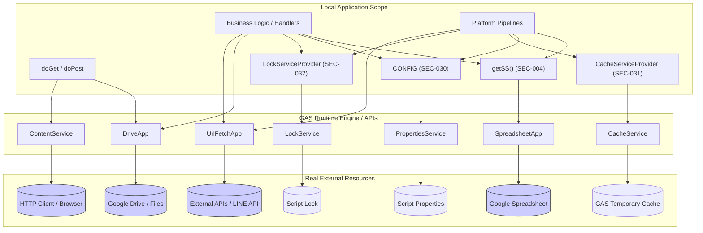

# External Dependency Analysis - active/api/v2_api.js
Version: 1.0
Status: SSOT (READ ONLY AUDIT)

---

## 1. External Dependency Inventory & Direction

`v2_api.js` が依存しているすべての外部サービス・ランタイム（GASネイティブ API 等）と、呼び出しの方向（直接／ラッパー経由）の一覧です。

| External API | Section ID | Layer | Direction (依存方向) | Wrapper Object | Call Count | Unique Elements |
|--------------|------------|-------|----------------------|----------------|:----------:|:---------------:|
| **SpreadsheetApp** | SEC-004, SEC-018, SEC-020, SEC-046, SEC-059, SEC-060 | Utility/Business/Auth | **Direct** (直接) | なし | 12 | 6 |
| **SpreadsheetApp** | Business層, Storage層, Auth (上記除く24箇所) | Business/Storage/Auth | **Via Wrapper** (ラッパー経由) | `getSS()` | 118 | 2 |
| **DriveApp** | SEC-004, SEC-020, SEC-024, SEC-025, SEC-028, SEC-049, SEC-050, SEC-063 | Utility/Business/Utility/Int | **Direct** (直接) | なし | 21 | 8 |
| **UrlFetchApp** | SEC-026, SEC-059, SEC-063, SEC-066 | Business/Auth/Int/Pipe | **Direct** (直接) | なし | 10 | 4 |
| **CacheService** | SEC-031 | Framework | **Direct** (直接) | なし | 2 | 1 |
| **CacheService** | EndpointRegistry, Router, refreshCache | Routing/Business | **Via Wrapper** (ラッパー経由) | `CacheServiceProvider`| 35 | 4 |
| **LockService** | SEC-032, SEC-009 | Framework/Routing | **Direct** (直接) | なし | 3 | 2 |
| **LockService** | Pipeline, submitDistribution, registerStaff | Pipeline/Business | **Via Wrapper** (ラッパー経由) | `LockServiceProvider` | 18 | 4 |
| **PropertiesService**| SEC-001, SEC-006, SEC-009, SEC-030 | Bootstrap/Entry/Rout/Frame| **Direct** (直接) | なし | 6 | 4 |
| **PropertiesService**| Business層, Auth, Pipeline | Business/Auth/Pipeline | **Via Wrapper** (ラッパー経由) | `CONFIG` (CONFIG.get) | 45 | 1 |
| **ContentService** | SEC-006, SEC-008, SEC-010, SEC-055, SEC-066 | Entry/Response/Pipeline | **Direct** (直接) | なし | 14 | 5 |
| **Utilities** | SEC-004, SEC-006, SEC-007, SEC-008, SEC-009, SEC-018, SEC-020, SEC-059 | Common | **Direct** (直接) | なし | 18 | 8 |
| **Session** | SEC-001 | Bootstrap | **Direct** (直接) | なし | 1 | 1 |

---

## 2. External Dependency Centrality (API別中心性)

各外部 API が何セクションから参照され、何回呼び出されているかの分布です。

| External API | Access Sections (ラッパー経由含む) | Direct Access Sections (直接呼出) | Total Calls (総呼出数) |
|--------------|:--------------------------------:|:-------------------------------:|:---------------------:|
| **PropertiesService / CONFIG** | 31 セクション | 4 セクション | 51 回 |
| **SpreadsheetApp / getSS()** | 24 セクション | 6 セクション | 130 回 |
| **Utilities** | 8 セクション | 8 セクション | 18 回 |
| **DriveApp** | 8 セクション | 8 セクション | 21 回 |
| **CacheService** | 12 セクション | 1 セクション | 37 回 |
| **LockService** | 6 セクション | 2 セクション | 21 回 |
| **ContentService** | 6 セクション | 6 セクション | 14 回 |
| **UrlFetchApp** | 4 セクション | 4 セクション | 10 回 |
| **Session** | 1 セクション | 1 セクション | 1 回 |

---

## 3. Runtime Context Classification (実行コンテキスト分類)

外部 API ごとに主に使用される実行ランタイムコンテキストの分類です。

- **WebApp (Web公開APIコンテキスト)**:
  - `ContentService` (doGet/doPostのエントリレスポンス返却)
  - `Session` (WebAppアクセス時のアクティブユーザーメール取得)
- **Batch / Trigger (一括バッチ・非同期コンテキスト)**:
  - `LockService` (スプレッドシートへの一括書き込み時の同時実行ガード)
  - `DriveApp` (エリア別の個別スプレッドシートやPDF/画像の自動生成・クリーンアップ)
- **Pipeline (共通実行パイプライン)**:
  - `UrlFetchApp` (認証ラインでの LINE API 疎通、AIOS Integration Bridge の外部 REST API 通信)
- **Common (共通全般)**:
  - `SpreadsheetApp` (名簿、実績、マスタシート等の取得・更新)
  - `CacheService` (レスポンスやテンポラリデータの読み書き速度向上)
  - `PropertiesService` (Script ID, Deployment ID 等のシステム定数値保持)
  - `Utilities` (CSVパース、時間文字列フォーマット、暗号ハッシュ生成など)

---

## 4. Runtime Dependency Matrix (レイヤー別外部API依存)

14レイヤーにおける各外部 API への呼び出し依存状況です。

| Layer | Spreadsheet | Drive | Cache | Lock | Properties | Content | UrlFetch | Utilities | Session |
|-------|:-----------:|:----:|:----:|:----:|:----------:|:-------:|:--------:|:---------:|:-------:|
| **Bootstrap** | - | - | - | - | 1 | - | - | - | 1 |
| **Entry Point** | 2 | - | - | - | 2 | 2 | - | 3 | - |
| **Routing** | - | - | 8 | 1 | 1 | - | - | 2 | - |
| **Response** | - | - | - | - | - | 8 | - | - | - |
| **Business** | 118 | 18 | - | 2 | 15 | - | 1 | 8 | - |
| **Storage** | 10 | - | - | - | - | - | - | - | - |
| **Pipeline** | - | - | - | 15 | 10 | 2 | 1 | - | - |
| **Authentication**| 2 | - | - | - | 12 | - | 4 | 5 | - |
| **Authorization** | 1 | - | - | - | 6 | - | - | - | - |
| **Licensing** | - | - | - | - | 4 | - | - | - | - |
| **Validation** | - | - | - | - | - | - | - | - | - |
| **Integration** | - | 3 | - | - | 2 | - | 4 | - | - |
| **Utility** | 1 | 2 | - | 1 | 1 | - | - | 1 | - |
| **Logging** | 2 | - | - | - | - | - | - | - | - |

---

## 5. GAS Native Dependency Matrix (実装形態分類)

外部 API に対するラッピング形態の分類です。

| Component / API | GAS Native (生のAPI直接) | GAS Wrapper (GAS標準内包) | Custom Wrapper (独自制御) |
|-----------------|:-----------------------:|:-------------------------:|:-------------------------:|
| **SpreadsheetApp**| ○ (ビジネスロジック直接) | - | ○ (`getSS()` ラッパーによるUI判定) |
| **DriveApp** | ○ (DriveApp 直接操作) | - | - |
| **UrlFetchApp** | ○ (UrlFetchApp 直接通信) | - | - |
| **CacheService** | - | - | ○ (`CacheServiceProvider` のシングルトン) |
| **LockService** | - | - | ○ (`LockServiceProvider` の try-catch) |
| **PropertiesService**| - | - | ○ (`CONFIG` によるインメモリ保持) |
| **ContentService** | ○ (ContentService) | - | - |
| **Utilities** | ○ (Utilities) | - | - |
| **Session** | ○ (Session) | - | - |

---

## 6. External Boundary Map

ビジネスロジックやプラットフォーム層から外部ランタイムに流れる境界の Mermaid ダイヤグラムです。

---

## 7. Dependency Concentration (外部依存集中セクション)

外部ランタイム API への直接依存数および呼び出し数が最も多い「結合の集中箇所」です。

- **SEC-020 (GPS Photo Upload)**:
  - 依存している直接 API: `DriveApp` (フォルダ取得・ファイル作成), `SpreadsheetApp` (直接セルの設定), `Utilities` (日付パーサー), `LockService` (直接ロック)
  - 内部ラッパー: `getSS()`, `traceLog()`
  - 総呼び出し件数: **14 件**
- **SEC-018 (Staff Registration)**:
  - 依存している直接 API: `SpreadsheetApp` (名簿登録処理), `Utilities` (名前正規化), `LockService` (排他ガード)
  - 内部ラッパー: `getSS()`, `traceLog()`
  - 総呼び出し件数: **12 件**
- **SEC-059 (Authentication Pipeline)**:
  - 依存している直接 API: `UrlFetchApp` (LINEトークン検証), `SpreadsheetApp` (Roster読み込み), `Utilities` (ハッシュ生成)
  - 内部ラッパー: `CONFIG`, `getSS()`, `traceLog()`
  - 総呼び出し件数: **11 件**

---

## 8. Runtime Constraint Inventory (GASランタイム制約)

Google Apps Script のランタイムが課す技術的限界および制約条件の一覧です。

- **同時実行（同時書き込み）制限**:
  - GASはサーバーレスでリクエストごとにスレッドが走るため、同一のスプレッドシートやプロパティへの同時書き込みは競合（書き込みロスト）を招きます。このため、必ず `LockService` による排他制御を行わなければデータ整合性を保証できない制約。
- **実行時間制限 (Execution Time Limit)**:
  - 1回のリクエストに対する最大実行時間は **6分間 (360秒)** に制限されています。これを超える処理（重いバッチなど）は途中で強制終了するため、チャンクに分けた非同期バッチ実行（`triggerBatch` 等）を行う必要がある制約。
- **CacheService の容量および TTL 制限**:
  - `CacheService` でキャッシュできる最大文字列サイズは値あたり **100KB** まで。また、有効期間 (TTL) は最大 **21,600秒 (6時間)** に制限されているため、永続ストレージとしては使用できない制約。
- **URLフェッチの割り当て制限 (UrlFetchApp)**:
  - 外部API呼び出し（UrlFetchApp）は、1アカウントあたり **1日20,000回** に制限されているため、リクエストごとの無駄な外部通信はキャッシュ等で削減する必要がある制約。

---

## 9. External Dependency Summary

外部依存の集計データです。

- **依存する外部 GAS API の種類**: 9 種類 (SpreadsheetApp, DriveApp, UrlFetchApp, CacheService, LockService, PropertiesService, ContentService, Utilities, Session)
- **総呼び出し回数**: **299 回**
- **最も中心的な API**: `PropertiesService` / `CONFIG` (31 セクションで使用)
- **ラッパーが未定義（直接呼び出されている）の外部 API**: `DriveApp`, `UrlFetchApp`, `ContentService`, `Utilities`, `Session`

---

> [!IMPORTANT]
> ## 監査免責事項
> **本監査は READ ONLY とする。監査結果に基づく修正計画は別工程で策定し、本監査ではコード・設定・Git・GASへの変更を一切行わない。**
