# Framework & Platform Mapping - active/api/v2_api.js
Version: 1.0
Status: SSOT (READ ONLY AUDIT)

---

## 1. Framework Component & Ownership Inventory

`v2_api.js` に実装されている主要なフレームワーク構成要素、所有セクション（Owner Section）、および主要エントリポイントの一覧です。

| Component Name | Owner Section | Layer | Row Size (Lines) | Primary Entry (エントリクラス/メソッド) | Responsibility (責任範囲) |
|----------------|---------------|-------|:----------------:|------------------------------------|---------------------------|
| **Platform Integration**| **SEC-066** | Pipeline | 242 | `PlatformIntegrationPipeline.execute()` | プラットフォーム全体制御、多段処理順序制御 |
| **Execution Context** | **SEC-036** | Pipeline | 50 | `PlatformExecutionContext` | リクエスト別の実行状態、ユーザー属性の保持 |
| **Hardening** | **SEC-058** | Pipeline | 227 | `HardeningPipeline.execute()` | 処理タイムアウト監視、サーキットブレイカー |
| **Authentication** | **SEC-059** | Authentication| 320 | `AuthenticationPipeline.execute()` | LINE LIFF / API Key を用いたリクエスト認証 |
| **Authorization** | **SEC-060** | Authorization | 231 | `AuthorizationPipeline.execute()` | ロールおよび機能スコープに基づくアクセス認可 |
| **Licensing** | **SEC-061** | Licensing | 229 | `LicensingPipeline.execute()` | テナントのエディション・有効期限ライセンス検証 |
| **Feature Control** | **SEC-062** | Pipeline | 245 | `FeatureAccessPipeline.execute()` | 機能フラグ、プラン別アクセス制御 |
| **AIOS Integration** | **SEC-063** | Integration | 433 | `AIOSBridgePipeline.execute()` | AIOS連携インテークおよびメッセージ転送制御 |
| **Validation** | **SEC-054** | Validation | 192 | `ValidationPipeline.validate()` | 入力リクエストパラメータのスキーマ検証 |
| **Routing** | **SEC-052** | Routing | 41 | `ApiRouter.route()` | ルート定義解決、新ハンドラへのディスパッチ |
| **Error Handling** | **SEC-055** | Response | 182 | `ExceptionHandler.handle()` | 例外キャッチ、APIエラーレスポンスへの変換 |
| **Monitoring** | **SEC-056** | Monitoring | 117 | `MetricsCollector` / `AuditCollector`| API処理時間計測、監査ログイベント収集 |

*(※非Businessレイヤー全体の総行数は R-3 統計値 4,136行 と 1行のズレもなく完全に同期しています)*

---

## 2. Framework Execution Order

リクエスト受信から応答返却までに、各フレームワークコンポーネントが処理を実行する順序です（R-2 実行フローと完全に同期）。

```
[doGet / doPost Entry]
  ↓
1. Platform Integration (SEC-066) -> プラットフォーム処理全体の開始
  ↓
2. Execution Context (SEC-036) -> 実行コンテキストオブジェクトの生成
  ↓
3. Monitoring (SEC-057 / SEC-065) -> ライフサイクル開始イベント（onPlatformStarted）の着火
  ↓
4. Hardening (SEC-058) -> タイムアウトタイマー起動、サーキットブレイカーチェック
  ↓
5. Authentication (SEC-059) -> 認証情報のパースと検証
  ↓
6. Authorization (SEC-060) -> 実行ロールパーミッション検証
  ↓
7. Licensing (SEC-061) -> テナント契約・ライセンス有効性検証
  ↓
8. Feature Control (SEC-062) -> 要求機能のアクセス権限チェック
  ↓
9. AIOS Integration (SEC-063) -> AIOSブリッジ連携コンテキストの解決
  ↓
10. Validation (SEC-054) -> 入力パラメータスキーマ検証
  ↓
11. Routing (SEC-052 / SEC-051) -> 対象ハンドラクラスの解決とディスパッチ
  ↓
12. [Business Logic Execution] -> ビジネスロジック処理
  ↓
13. Error Handling (SEC-055) -> (※例外発生時のみ) 例外を catch しエラーJSONへマッピング
  ↓
14. Response Formatting (SEC-010) -> ContentService による JSON レスポンス返却
  ↓
15. Monitoring (SEC-056 / SEC-065) -> ライフサイクル完了イベント（onPlatformFinished）の実行
```

---

## 3. Cross-Layer Responsibility Matrix

各フレームワーク構成要素がどの責任領域にまたがっているかのマッピングです。

| Component Name | Routing (経路解決) | Security (認証/認可) | Pipeline (処理順序) | Runtime (監視/例外/インフラ) |
|----------------|:-----------------:|:-------------------:|:------------------:|:----------------------------:|
| **Platform Integration** | - | - | ○ (主制御) | ○ |
| **Execution Context** | - | - | ○ | - |
| **Hardening** | - | ○ | ○ | ○ |
| **Authentication** | - | ○ (主制御) | - | - |
| **Authorization** | - | ○ (主制御) | - | - |
| **Licensing** | - | ○ | - | - |
| **Feature Control** | - | ○ | - | - |
| **AIOS Integration** | - | - | ○ | ○ |
| **Validation** | - | - | ○ | - |
| **Routing** | ○ (主制御) | - | - | - |
| **Error Handling** | - | - | - | ○ (主制御) |
| **Monitoring** | - | - | - | ○ (主制御) |

---

## 4. Framework ↔ Business Matrix (ビジネス支援状況)

フレームワークがどのビジネスドメインをサポートし、何の制御を差し挟んでいるかの対応です。

| Framework Component | Staff | Distribution | Area | Flyer | GPS |
|---------------------|:-----:|:------------:|:----:|:-----:|:---:|
| **Platform Integration** | ○ | ○ | ○ | ○ | ○ |
| **Execution Context** | ○ | ○ | ○ | ○ | ○ |
| **Hardening** | ○ | ○ | ○ | ○ | ○ |
| **Authentication** | ○ | ○ | ○ | ○ | ○ |
| **Authorization** | ○ | ○ | ○ | ○ | ○ |
| **Licensing** | ○ | ○ | ○ | ○ | ○ |
| **Feature Control** | ○ | ○ | ○ | ○ | ○ |
| **AIOS Integration** | - | - | - | - | - |
| **Validation** | ○ | ○ | ○ | ○ | - |
| **Routing** | ○ | ○ | ○ | ○ | ○ |
| **Error Handling** | ○ | ○ | ○ | ○ | ○ |
| **Monitoring** | ○ | ○ | ○ | ○ | ○ |

*(※AIOS Integration は外部接続ブリッジであるため、現時点ではローカルビジネスドメインに直接バインドされていません。R-7 のビジネスドメインマッピングと完全に同期しています)*

---

## 5. Framework ↔ Infrastructure / External Matrix

フレームワークが利用する共有インフラおよび外部 API（GASネイティブ）の使用マトリクスです。

### 共有インフラ利用状況
- **`CONFIG`** 利用: `Routing`, `Platform Integration`, `Authentication`, `Authorization`, `Licensing`, `Feature Control`, `AIOS Integration` (計7要素)
- **`Cache`** 利用: `Routing`, `Platform Integration`
- **`Lock`** 利用: `Platform Integration`
- **`Logging`** 利用: `Platform Integration`, `Authentication`
*(※R-5 のインフラ解析データと 100% 同期しています)*

### 外部 API 直接利用状況
- **`PropertiesService`** 利用: `Routing`, `Platform Integration`
- **`UrlFetchApp`** 利用: `Authentication`, `AIOS Integration`, `Platform Integration`
- **`ContentService`** 利用: `Routing`, `Error Handling`, `Platform Integration`
- **`Session`** 利用: `Platform Integration`
*(※R-6 の外部依存解析データと 100% 同期しています)*

---

## 6. Framework Lifecycle

各フレームワークコンポーネントのライフサイクル管理の状態定義です。

| Component Name | Created (メモリ定義) | Initialized (インスタンス化) | Active (実行中) | Released (クリア/破棄) |
|----------------|---------------------|-----------------------------|-----------------|------------------------|
| **Platform Integration**| Global Scope (ホイスティング) | `doGet`/`doPost` 進入時 | `execute(e)` の実行中 | GAS実行スレッド終了時 |
| **Execution Context** | Global Scope (L101) | Pipeline 処理開始時 | Pipeline 処理全般 | Pipeline 終了時の `lastContext = null` |
| **Hardening** | Global Scope (L3165) | `HardeningPipeline.getInstance()` | `execute(req, ctx)` 実行中| `finally` でのタイムアウト解放時 |
| **Authentication** | Global Scope (L3392) | `AuthenticationPipeline.getInstance()` | 認証ロジック実行中 | GAS実行スレッド終了時 |
| **Authorization** | Global Scope (L3712) | `AuthorizationPipeline.getInstance()` | 認可ロジック実行中 | GAS実行スレッド終了時 |
| **Licensing** | Global Scope (L3943) | `LicensingPipeline.getInstance()` | ライセンス検証実行中 | GAS実行スレッド終了時 |
| **Feature Control** | Global Scope (L4172) | `FeatureAccessPipeline.getInstance()` | 機能フラグ検証実行中 | GAS実行スレッド終了時 |
| **AIOS Integration** | Global Scope (L4417) | `AIOSBridgePipeline.getInstance()` | ブリッジ連携処理実行中 | GAS実行スレッド終了時 |
| **Validation** | Global Scope (L2593) | `ValidationPipeline.getInstance()` | スキーマバリデーション実行中 | GAS実行スレッド終了時 |
| **Routing** | Global Scope (L2540) | `ApiRouter.getInstance()` | ルートディスパッチ実行中 | GAS実行スレッド終了時 |
| **Error Handling** | Global Scope (L2785) | `ExceptionHandler.handle()` 呼出時 | 例外マッピング処理中 | レスポンス出力完了時 |
| **Monitoring** | Global Scope (L2967) | `EventDispatcher.getInstance()` | メトリクス収集・ログ送信中| `onPlatformFinished` 完了時 |

---

## 7. Platform Interaction Map

フレームワーク・プラットフォームコンポーネント同士の相互作用（静的結合関係）を示す Mermaid 関係図です。

```mermaid
graph TD
    %% Component Nodes
    Integration[Platform Integration Core SEC-066]
    Context[Execution Context SEC-036]
    Hardening[Hardening Pipeline SEC-058]
    Auth[Authentication Pipeline SEC-059]
    Authz[Authorization Pipeline SEC-060]
    Licensing[Licensing & Edition SEC-061]
    Feature[Feature Access Control SEC-062]
    AIOS[AIOS Integration Bridge SEC-063]
    Validation[Validation Pipeline SEC-054]
    Routing[API Router SEC-052]
    Error[Error Handling SEC-055]
    Monitoring[Monitoring & Audit SEC-056]

    %% Interactions
    Integration -->|1. Creates| Context
    Integration -->|2. Notifies| Monitoring
    Integration -->|3. Runs| Hardening
    Integration -->|4. Runs| Auth
    Integration -->|5. Runs| Authz
    Integration -->|6. Runs| Licensing
    Integration -->|7. Runs| Feature
    Integration -->|8. Runs| AIOS
    Integration -->|9. Runs| Validation
    Integration -->|10. Calls| Routing
    
    %% Error Flow
    Integration -.->|Exception catch| Error

    style Integration fill:#ccf,stroke:#333
    style Context fill:#fce,stroke:#333
```



---

## 8. Framework Constraint Inventory

フレームワークが持つ固有の技術的および構造的制約事項の一覧です。

- **多段パイプライン実行順序への絶対依存**:
  - `PlatformIntegrationPipeline.execute()` 内の処理順序はハードコードされており、各コンポーネント（認証、認可、ライセンス等）が正常にコンテキスト（Context）にバインドした状態データを後続ステージが前提としているため、実行順序を1つでも変更すると、前提データの欠落により NullPointer 例外や不正アクセスと判定される制約。
- **グローバルシングルトンプロバイダへの依存**:
  - `CONFIG` や `EndpointRegistry` などがグローバルシングルトンとしてインスタンス化されているため、一部のモジュールだけを別ファイルや外部APIに切り出す際にも、これらのシングルトンオブジェクトを必ず複製するか、DI（依存性注入）機構を導入してパラメータ伝播させなければならない制約。
- **GAS ランタイムの例外伝播制限**:
  - GASではスローされた例外が `ExceptionHandler` まで正しくキャッチされない場合、WebApp が HTTP 500 でクラッシュし、呼出元（LINEサーバーやクライアント）にHTML形式のクラッシュ画面が返却されます。このため、例外処理（Error Handling）は必ずプラットフォーム最上位ですべて catch し、適切な JSON ラッパーに変換して終端させなければならない制約。

---

## 9. Framework Summary

フレームワークおよびプラットフォーム構造の集計要約です。

- **抽出されたフレームワークコンポーネント数**: 12 コンポーネント
- **全フレームワーク層の行数**: **4,136 行** (全体の 79.00% を占有)
- **インフラ/外部依存**: ほぼすべてのコンポーネントが `CONFIG` (スクリプトプロパティ) に依存し、UrlFetchApp および ContentService と緊密に結合していること。

---

> [!IMPORTANT]
> ## 監査免責事項
> **本監査は READ ONLY とする。監査結果に基づく修正計画は別工程で策定し、本監査ではコード・設定・Git・GASへの変更を一切行わない。**
